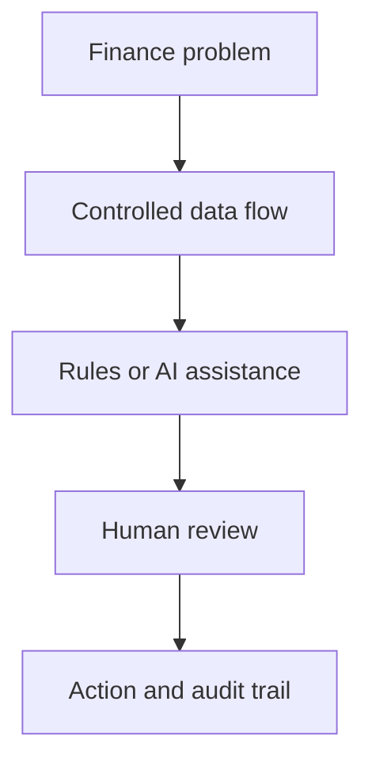

# Finance Transformation with AI and Automation

Practical systems that improve finance operations, controls, reporting, and decision-making.

This portfolio presents selected work across transaction monitoring, financial reporting, cash visibility, accounts payable, reconciliation, document operations, and workflow automation. Each case study starts with a business problem and shows how finance knowledge, data, software, and human oversight were combined into a usable operating system.

> **Public portfolio disclosure**
>
> This repository contains sanitized, high-level case studies and synthetic examples only. No proprietary information, confidential data, production source code, prompts, credentials, thresholds, scoring logic, company-specific rules, or other business logic is shared. Architectures are intentionally abstracted and identifying details are removed.

## Selected systems

| Capability | Case study | Business outcome |
|---|---|---|
| Detect | [Transaction Fraud Monitoring](case-studies/transaction-fraud-monitoring.md) | Combines statistically calibrated detection, AI-assisted interpretation, and a follow-up dashboard with human decisions and an audit trail. |
| Inform | [Financial Performance Dashboard](case-studies/financial-dashboard.md) | Consolidates fragmented reporting into one responsive view backed by scheduled snapshots. |
| Connect | [Secure Bank Data Pipeline](case-studies/bank-data-pipeline.md) | Brings multi-account bank data into a controlled reporting layer without placing credentials in spreadsheets. |
| Control | [AP KPI Monitor](case-studies/ap-kpi-monitor.md) | Makes payment bottlenecks, aging, ownership, and cycle time visible by next required action. |
| Automate | [Task It](case-studies/task-it.md) | Converts an email into an assigned operational task without retyping or changing systems. |
| Engage | [Investor Relationship CRM](case-studies/investor-relationship-crm.md) | Uses a custom Google Workspace application to unify investor interactions, commitments, documents, and AI-assisted drafting. |
| Reconcile | [Deposit Reconciliation](case-studies/deposit-reconciliation.md) | Compares bank deposits with the accounting ledger and sends only actionable exceptions. |
| Govern AI | [AI-Assisted Filing Queue](case-studies/filing-queue.md) | Uses AI to suggest names and destinations while keeping every rename and move human-controlled. |
| Clarify | [Intercompany Statements](case-studies/intercompany-statements.md) | Converts a shared loan ledger into entity-level positions, action items, and data-quality exceptions. |

## Transformation approach

Across the portfolio, the design principles are consistent:

1. Start with the financial control or operating decision, not the technology.
2. Automate collection, comparison, routing, and presentation before automating judgment.
3. Keep consequential decisions with an accountable person.
4. Design failure states so the workflow remains safe and understandable.
5. Protect credentials and sensitive financial information outside user-facing tools.
6. Preserve traceability through logs, stable identifiers, and explicit review states.

## Technology themes

Google Apps Script, Google Workspace add-ons, Google Sheets, Cloud Run, secret management, bank-data APIs, monday.com, Slack, Python, JavaScript, automated tests, structured outputs, and human-in-the-loop AI workflows.

## About

Created by **Luis Enrique García**, a finance leader focused on finance transformation, applied AI, automation, controls, and decision systems.

For the disclosure and publication boundaries used throughout this portfolio, see [Portfolio Boundaries](docs/portfolio-boundaries.md).
