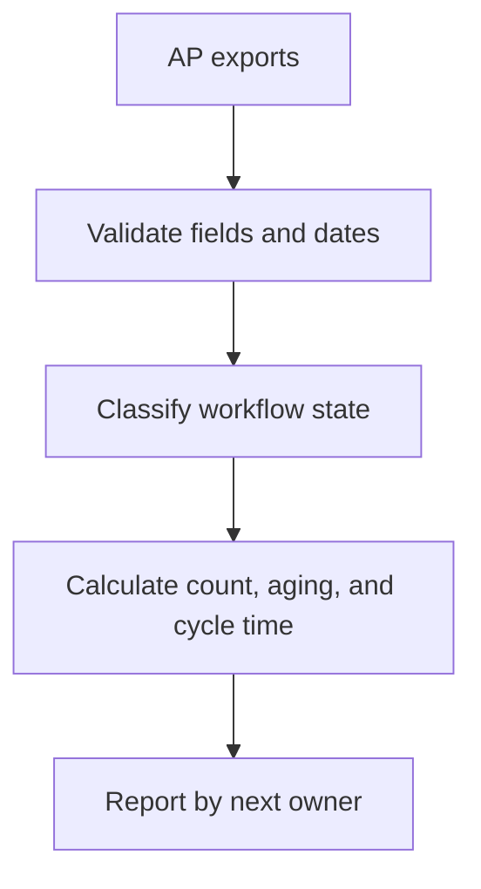

# Accounts Payable KPI Monitor

> Sanitized case study. No invoice data, vendors, internal status mappings, thresholds, spreadsheet identifiers, production code, or proprietary business logic is shared.

## Business problem

A single payment-speed number can hide the real reason an invoice is delayed. Finance needed to distinguish missing information, pending approvals, queued payments, completed payments, and the owner of the next action.

## Solution

An on-demand reporting tool converts an accounts-payable export into operational KPIs grouped by who must act next. It measures backlog, aging, pipeline stage, and payment cycle time without mixing distinct populations.

## Business impact

- Made bottlenecks visible instead of blending them into one average.
- Separated upstream missing-information delays from finance processing time.
- Clarified ownership of the next action.
- Exposed aging and outliers alongside weekly throughput.
- Supported more productive operating reviews and process improvement.

## Control design

- Independent treatment of current-period flow and historical backlog
- Header-based field mapping to tolerate export changes
- Explicit status normalization
- Clear denominator and date-range definitions
- Exception handling for incomplete records

## Technology pattern

Google Apps Script, spreadsheet exports, date normalization, grouped metrics, and an interactive report dialog.

## Portfolio boundary

Internal status values, field mappings, formulas, thresholds, operating targets, vendor information, and implementation code remain private.
