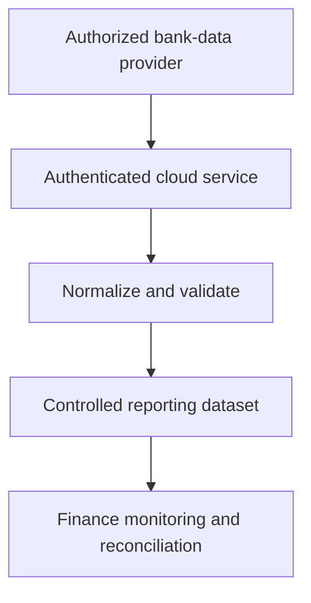

# Secure Bank Data Pipeline

> Sanitized case study. No bank names, accounts, credentials, tokens, infrastructure identifiers, transaction data, production code, or proprietary business logic is shared.

## Business problem

Cash visibility required repeated bank logins and manual consolidation. The team needed a reliable multi-account feed while keeping banking credentials and API secrets out of spreadsheets and user-facing scripts.

## Solution

A scheduled pipeline retrieves authorized bank data through a controlled cloud service and writes normalized balances and transactions into a reporting layer.

Secrets remain in managed secret storage. The user-facing spreadsheet initiates synchronization but never contains bank credentials or provider access tokens.

## Business impact

- Replaced fragmented bank lookups with scheduled cash visibility.
- Created a dependable data foundation for monitoring and reconciliation systems.
- Reduced manual collection and copy-paste risk.
- Separated sensitive credentials from spreadsheets and operational scripts.
- Supported multiple financial institutions through one normalized interface.

## Control design

- Managed secret storage
- Authenticated service-to-service requests
- Environment separation
- Source and destination validation
- Read-oriented downstream use

## Technology pattern

Bank-data APIs, cloud services, identity-based authentication, secret management, scheduled Google Apps Script, and structured spreadsheet outputs.

## Portfolio boundary

Provider credentials, account details, cloud identifiers, access policies, production URLs, mappings, and operational code remain private.
