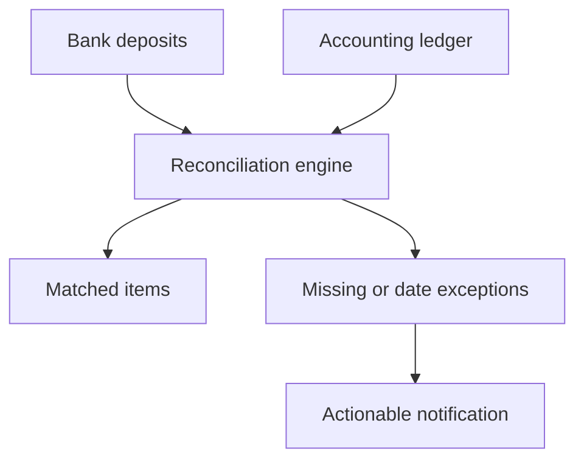

# Deposit Reconciliation

> Sanitized case study. No bank transactions, accounting records, matching tolerances, ignore lists, production code, or proprietary business logic is shared.

## Business problem

Cash can reach the bank before the corresponding receipt is entered correctly in the property-accounting system. Without a daily control, missing or misdated entries can leave the general ledger incomplete until someone notices manually.

## Solution

A scheduled reconciliation compares posted bank deposits with the latest operating-cash ledger and sends an email only when it finds actionable exceptions.

Each exception retains a stable source identifier for traceability. The output distinguishes different exception types because the corrective action is not the same.

## Business impact

- Turned income reconciliation into a daily automated control.
- Identified missing and misdated receipts quickly.
- Reduced manual comparison across bank and accounting exports.
- Sent notifications only when action was required.
- Improved traceability from exception to source transaction.

## Control design

- Read-only source feeds
- Defined reconciliation period
- Stable identifiers
- Separate exception categories
- Explicit treatment of known exceptions

## Technology pattern

Bank-data feed, property-accounting export, Gmail ingestion, Google Sheets, scheduled Apps Script, and exception reporting.

## Portfolio boundary

Matching logic, tolerances, source identifiers, account data, property information, ignore rules, and production code remain private.
