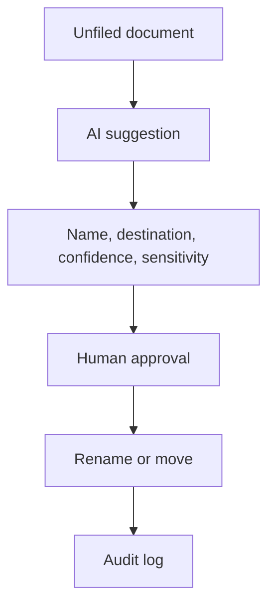

# AI-Assisted Filing Queue

> Sanitized case study. No documents, prompts, naming rules, folder maps, model instructions, production code, or proprietary business logic is shared.

## Business problem

Unfiled documents accumulate when naming and destination decisions require specialized context. Fully autonomous filing creates unacceptable risk when files contain sensitive information or the classification is uncertain.

## Solution

An AI-assisted queue proposes a compliant document name and destination, shows its confidence and sensitivity flags, and requires a person to approve renaming and filing separately.

Low-confidence results route to manual review. Sensitive documents cannot be filed automatically. A preview mode shows intended changes without modifying the document repository.

## Business impact

- Reduced the effort required to organize incoming documents.
- Standardized naming and destination suggestions.
- Kept irreversible or sensitive decisions under human control.
- Added an audit trail to document operations.
- Converted classification failures into visible manual work instead of silent guesses.

## Control design

- Separate approval for rename and move
- Sensitivity flag and manual route
- Preview before execution
- No deletion capability
- Concurrency protection and audit logging
- Validation before applying changes

## Technology pattern

Large language model, structured outputs, Google Drive, Google Sheets, Google Apps Script, and unit-tested validation components.

## Portfolio boundary

Prompts, naming conventions, folder taxonomy, sensitivity rules, classification logic, internal documents, and production implementation remain private.
