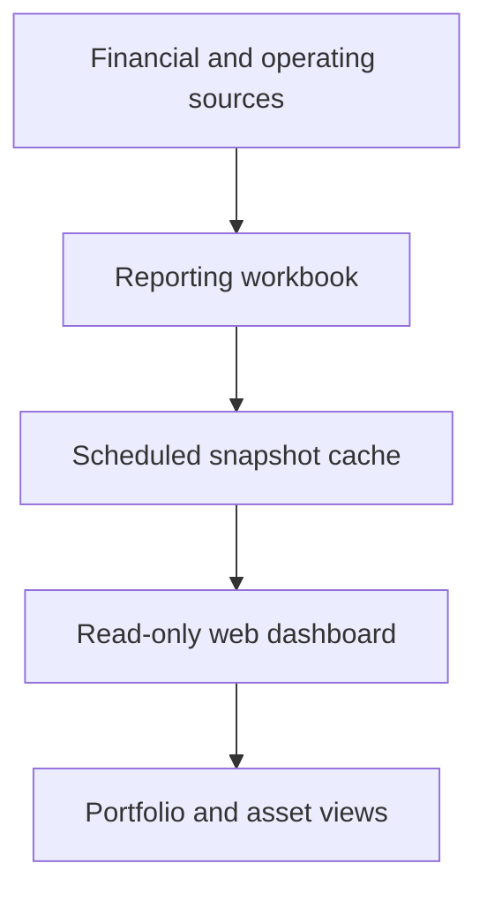

# Financial Performance Dashboard

> Sanitized case study. No company financials, source workbooks, formulas, production code, access configuration, or proprietary business logic is shared.

## Business problem

Portfolio reporting lived across multiple financial statements, property systems, and spreadsheets. Leadership needed one consistent view without granting every viewer access to the underlying files or repeatedly recalculating live workbooks.

## Solution

A two-layer dashboard consolidates financial information into a controlled reporting workbook and serves precomputed snapshots through a responsive, read-only web interface.

The cache separates dashboard consumption from the live reporting model. Users can move between portfolio and asset views without direct access to the underlying spreadsheets.

## Business impact

- Consolidated fragmented reporting into a consistent management view.
- Improved access to current KPIs, ratios, and trends.
- Reduced load and access risk on live finance workbooks.
- Enabled self-service review without distributing source files.
- Created a reusable reporting layer for leadership and asset-level conversations.

## Control design

- Read-only presentation layer
- Restricted organizational access
- Scheduled, precomputed snapshots
- Separation between source models and viewers
- Consistent portfolio and asset definitions

## Technology pattern

Google Apps Script, spreadsheet-based modeling, scheduled caching, structured snapshots, responsive HTML, and chart rendering.

## Portfolio boundary

The production formulas, financial data, property structure, workbook identifiers, deployment configuration, and internal KPI definitions remain private.
