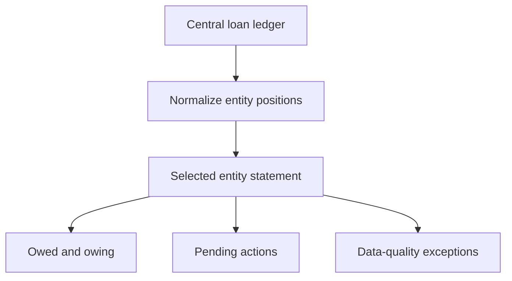

# Intercompany Loan Statements

> Sanitized case study. No entities, balances, loan terms, spreadsheet identifiers, internal actions, production code, or proprietary business logic is shared.

## Business problem

A shared intercompany-loan ledger can record transactions accurately while still making it difficult to answer a basic question: what does one entity owe, what is owed to it, and what requires attention?

## Solution

An interactive statement generator converts the central ledger into a selected entity's obligations, receivables, net position, pending decisions, settled history, and data-quality exceptions.

The statement refreshes when the user selects a different entity. Records that cannot be interpreted cleanly appear in an attention section instead of being silently excluded.

## Business impact

- Made entity-level positions immediately understandable.
- Reduced manual filtering and statement preparation.
- Combined balances, history, and unresolved actions in one view.
- Exposed data-quality problems rather than hiding them.
- Improved support for reconciliation and management review.

## Control design

- Central ledger remains the source of truth
- Read-oriented generated statements
- Explicit exception section
- Consistent entity normalization
- Rebuildable presentation layer

## Technology pattern

Google Sheets, Google Apps Script, event-driven rendering, entity normalization, and structured statement generation.

## Portfolio boundary

Entity names, balances, loan terms, decision history, normalization rules, spreadsheet details, and production code remain private.
