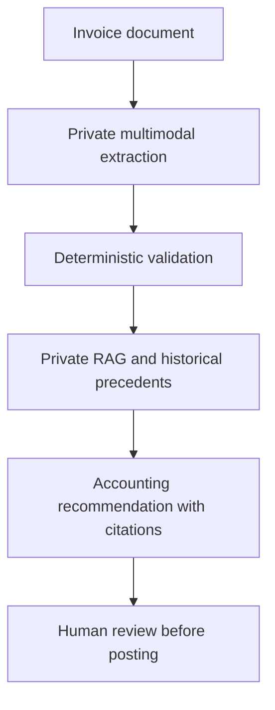

# Private Invoice Intelligence

> Sanitized case study. No invoices, accounting records, tenant or vendor data, chart-of-accounts mappings, prompts, retrieval corpus, classification logic, production code, or proprietary business rules are shared.

## Business problem

Invoice processing is a seat-level bookkeeping responsibility that requires more than extracting fields. Each invoice must be identified, checked for completeness and arithmetic accuracy, matched to the correct entity and property, evaluated for duplicates, classified consistently, and supported by applicable accounting policy. Doing this manually is slow, difficult to standardize, and dependent on individual memory.

Using commercial AI services for this work can also create confidentiality and mosaic risk: repeated disclosure of individually limited details may collectively reveal a broader picture of the company's vendors, properties, spending, and operations.

## Solution

The system is designed to own the invoice-review and coding workflow normally assigned to a bookkeeping seat while keeping final posting under human control. It runs an open-weight multimodal model on controlled, private infrastructure, so invoice contents are not sent to a commercial large-language-model API.

Retrieval-augmented generation grounds each recommendation in approved accounting and tax sources, company policy, reference data, and a private precedent layer built from historical accounting outcomes. Historical examples are retrieved as context when relevant; they are not presented as external authority and are not exposed to a commercial AI provider.

## End-to-end responsibility

- Extract invoice fields from text and images.
- Resolve the relevant entity, property, vendor, and accounting references.
- Validate totals and arithmetic outside the language model.
- Detect potential duplicates.
- Retrieve applicable accounting, tax, company-policy, and historical precedent context.
- Recommend accounting classification with source citations and confidence signals.
- Route uncertain or conflicting cases to a human reviewer.
- Produce structured output for downstream workflow without autonomously posting entries.

## Business impact

- Converts a fragmented bookkeeping task into a consistent, end-to-end operating workflow.
- Reduces manual invoice reading, data entry, research, and repeated coding decisions.
- Applies historical accounting treatment consistently without depending on one person's memory.
- Keeps confidential invoice and accounting information away from commercial AI APIs.
- Reduces mosaic risk by keeping the combined financial context inside controlled infrastructure.
- Makes recommendations reviewable through structured outputs, citations, validation results, and confidence signals.
- Scales infrastructure down when idle, supporting strong privacy without requiring a continuously running model server.

## Control design

- The model recommends; it never posts accounting entries.
- Financial amounts are extracted verbatim, parsed by software, and checked deterministically.
- Tax, accounting, company-policy, and historical sources retain distinct authority levels.
- Unsupported or low-confidence conclusions are routed to human review.
- The only fallback is human review, not a commercial AI service.
- Confidential source documents and historical accounting data remain outside the code repository.

## Technology pattern

Private open-weight multimodal model, on-demand controlled infrastructure, retrieval-augmented generation, vector retrieval, structured outputs, deterministic validation, duplicate detection, reference-data resolution, evaluation pipelines, and human-in-the-loop review.

## Portfolio boundary

The production prompts, model settings, retrieval corpus, historical accounting records, entity and property mappings, chart of accounts, classification logic, evaluation data, infrastructure configuration, credentials, and implementation code remain private.
