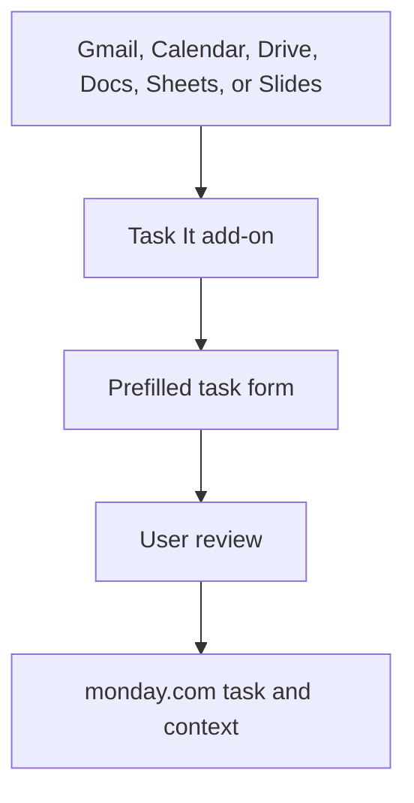

# Task It: Google Workspace-to-Workflow Automation

> Sanitized case study. No email content, board identifiers, user mappings, API credentials, production code, or proprietary business logic is shared.

## Business problem

Important work can begin anywhere in Google Workspace. Moving it into a project-management system often requires switching applications, retyping context, and manually recreating ownership and due dates.

## Solution

A Google Workspace add-on creates structured monday.com tasks from the tools employees already use, including Gmail, Calendar, Drive, Docs, Sheets, and Slides. It is also available from Gmail on mobile. The add-on prefills relevant context, lets the user review the task, and sends it into the work-management system without leaving the current Google Workspace application.

The workflow turns information into action at the point where the user encounters it. In Gmail, it can carry message context for assignees who may not have mailbox access. A failure while attaching context does not hide the fact that the task itself was successfully created.

## Business impact

- Reduced friction between Google Workspace and task execution.
- Eliminated repeated entry of titles, senders, links, and relevant context.
- Improved task traceability and ownership.
- Kept users inside Gmail, Calendar, Drive, Docs, Sheets, and Slides.
- Extended task creation to Gmail on mobile.
- Handled partial failures transparently instead of creating duplicates.

## Control design

- User review before task creation
- Narrow application permissions
- Clear success and warning states
- Context limited to the item currently being used
- No email forwarding or autonomous task creation

## Technology pattern

Google Workspace add-on, Gmail mobile integration, Google Apps Script, monday.com API, JavaScript, and automated tests.

## Portfolio boundary

Board structure, account mappings, Workspace content, API configuration, production code, and internal routing logic remain private.
