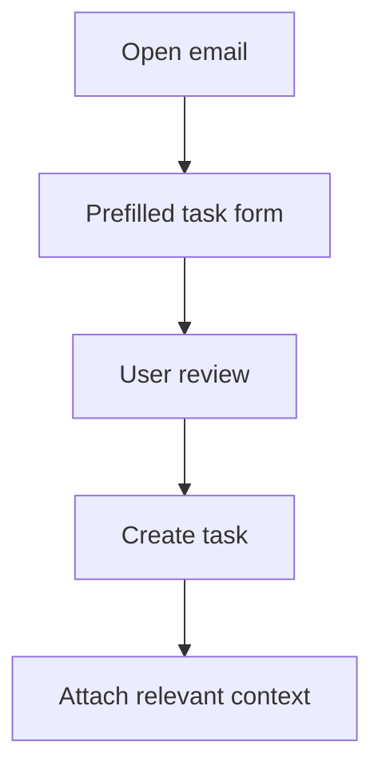

# Task It: Email-to-Workflow Automation

> Sanitized case study. No email content, board identifiers, user mappings, API credentials, production code, or proprietary business logic is shared.

## Business problem

Important work often begins inside email but is lost when converting the message into a project-management task requires switching systems and retyping context.

## Solution

A Google Workspace add-on creates a structured task from the email currently open. It prefills useful fields, lets the user review them, creates the task, and carries essential message context into the work-management system.

The workflow is designed for assignees who may not have mailbox access. A failure while attaching context does not hide the fact that the task itself was successfully created.

## Business impact

- Reduced friction between communication and execution.
- Eliminated repeated entry of subjects, senders, and context.
- Improved task traceability and ownership.
- Kept users inside their normal email workflow.
- Handled partial failures transparently instead of creating duplicates.

## Control design

- User review before task creation
- Narrow application permissions
- Clear success and warning states
- Bounded message content
- No email forwarding or autonomous task creation

## Technology pattern

Google Workspace add-on, Google Apps Script, monday.com API, JavaScript, and automated tests.

## Portfolio boundary

Board structure, account mappings, email data, API configuration, production code, and internal routing logic remain private.
