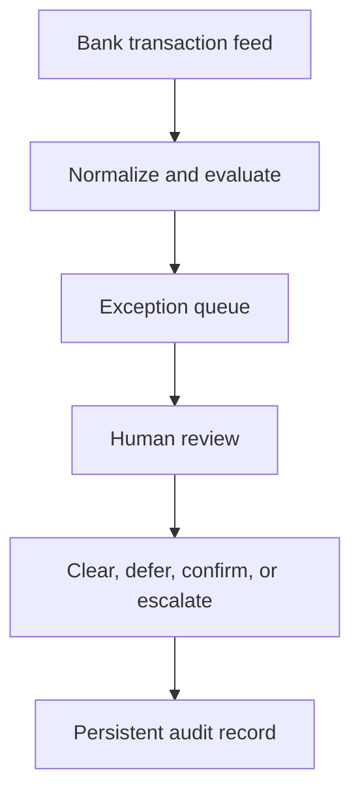

# Transaction Fraud Monitoring

> Sanitized case study. No proprietary information, detection thresholds, scoring rules, allowlists, prompts, production code, or company-specific business logic is shared.

## Business problem

Reviewing activity across multiple bank accounts is repetitive, easy to defer, and difficult to document consistently. A finance team needs to identify unusual activity quickly without creating alert fatigue or allowing automated software to make consequential decisions.

## Solution

The system converts daily bank activity into a controlled exception-review workflow. It evaluates new transactions, opens review items when attention is required, reminds reviewers about unresolved items, and preserves the final disposition in an audit trail.

The reviewer works from a dedicated interface rather than editing the underlying transaction data. Unresolved items remain visible, temporary deferrals return for review, and trusted recurring activity requires documented context.

## Business impact

- Replaced an informal manual review with a daily, exception-based control.
- Centralized decisions and supporting context in a persistent review record.
- Reduced the risk that unresolved items disappear inside email or spreadsheets.
- Preserved human accountability for every consequential decision.
- Created a repeatable evidence trail for follow-up and dispute support.

## Control design

- Read-only access to source transactions
- No capability to initiate or move money
- Human decision required to resolve an exception
- Repeat notification for unresolved items
- Restricted reviewer access
- Explicit state transitions and durable history

## Technology pattern

Scheduled ingestion, deterministic evaluation, a protected review ledger, a lightweight web interface, notification routing, and automated verification.

## Portfolio boundary

The production rules, calibration process, thresholds, review categories, trusted-destination logic, account structure, and implementation code remain private.
