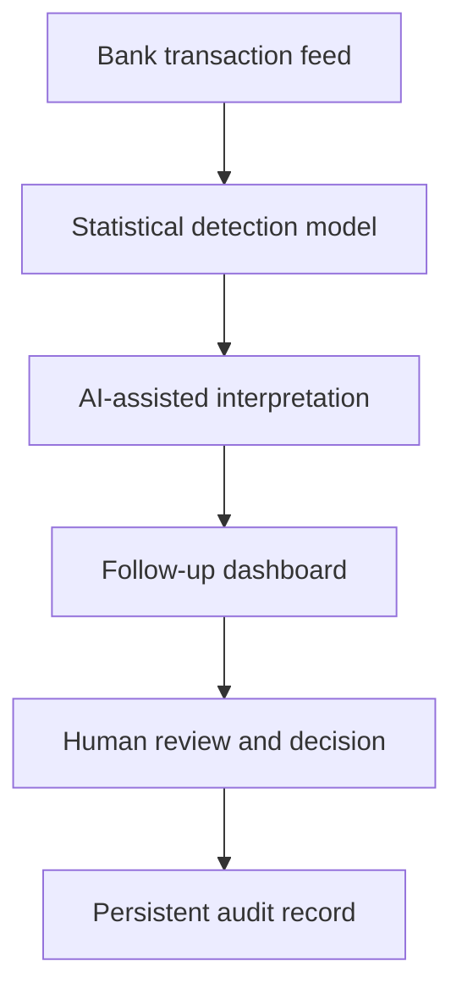

# Transaction Fraud Monitoring

> Sanitized case study. No proprietary information, model parameters, feature engineering, detection thresholds, scoring rules, allowlists, AI prompts, production code, or company-specific business logic is shared.

## Business problem

Reviewing activity across multiple bank accounts is repetitive, easy to defer, and difficult to document consistently. A finance team needs to identify unusual activity quickly without creating alert fatigue or allowing automated software to make consequential decisions.

## Solution

The system converts daily bank activity into a controlled exception-review workflow. A statistically calibrated detection model evaluates transaction patterns and produces risk signals. An AI-assisted interpretation layer turns those signals into concise, reviewer-friendly context, while a follow-up dashboard organizes open alerts, deferrals, decisions, and final dispositions.

The statistical layer determines what is flagged; the AI layer helps explain the result but does not replace or erase the underlying finding. The reviewer works from a dedicated dashboard rather than editing the source transaction data. Unresolved items remain visible, temporary deferrals return for review, and trusted recurring activity requires documented context.

## Business impact

- Replaced an informal manual review with a daily, exception-based control.
- Converted statistical signals into clear, actionable context for finance reviewers.
- Created one dashboard for open cases, ownership, follow-up, and final disposition.
- Centralized decisions and supporting context in a persistent review record.
- Reduced the risk that unresolved items disappear inside email or spreadsheets.
- Preserved human accountability for every consequential decision.
- Created a repeatable evidence trail for follow-up and dispute support.

## Control design

- Read-only access to source transactions
- No capability to initiate or move money
- Detection logic controls what is flagged; AI interpretation remains advisory
- AI cannot remove an underlying finding or make the final fraud determination
- Human decision required to resolve an exception
- Repeat notification for unresolved items
- Restricted reviewer access
- Explicit state transitions and durable history

## Technology pattern

Scheduled ingestion, statistically calibrated detection, AI-assisted interpretation, a protected review ledger, a follow-up dashboard, notification routing, and automated verification.

## Portfolio boundary

The production model design, feature engineering, calibration process, thresholds, scoring rules, AI prompts, review categories, trusted-destination logic, account structure, and implementation code remain private.
